### Part A: Meaning-Use Analysis of "Sliding" Strategy

#### 1. Central Material Inferences

The "Sliding" strategy for subtraction (e.g., solving 73 - 47) is based on the principle of maintaining a constant difference. The core material inference is:

*   **If you alter the minuend and the subtrahend by the same amount, then the difference remains unchanged.**

This can be expressed formally as: `(a - b) = (a + c) - (b + c)`.  The strategy operationalizes this abstract principle. For example, to solve `73 - 47`, one might infer that adding 3 to both numbers will make the problem easier (`76 - 50`) without changing the result.

#### 2. PP-Necessities and PP-Sufficiencies

*   **PP-Necessities (Prerequisite Practices):**
    *   **P1 (Number Line Intuition):** A basic understanding of numbers as positions on a line, and of subtraction as measuring the distance between two points.
    *   **P2 (Counting/Basic Arithmetic):** The ability to perform simple addition and subtraction, at least with multiples of 10.
    *   **P3 (Base-10 Structure):** Recognizing that numbers ending in 0 are "easier" to work with.

*   **PP-Sufficiencies (Practices Sufficient to Deploy):**
    *   **P4 (Difference Invariance):** The practical ability to add or subtract the same number from both the minuend and subtrahend. This is the core practice of the strategy.
    *   **P5 (Strategic Adjustment):** The ability to identify a target number (usually a multiple of 10) and calculate the necessary adjustment to "slide" the subtrahend to that target.

#### 3. Circumstances and Consequences of Application

*   **Circumstances of Application:**
    *   A subtraction problem is presented, typically one that is cumbersome to solve with direct methods like borrowing (e.g., `73 - 47`, where `3 < 7`).
    *   The practitioner recognizes that adjusting the numbers might simplify the calculation.

*   **Consequences of Application:**
    *   The original subtraction problem is transformed into a new, equivalent problem.
    *   The new problem is computationally simpler, usually involving a subtrahend that is a multiple of 10.
    *   The final answer is obtained by solving the simpler problem.

#### 4. Meaning-Use Diagram (MUD) for "Sliding"

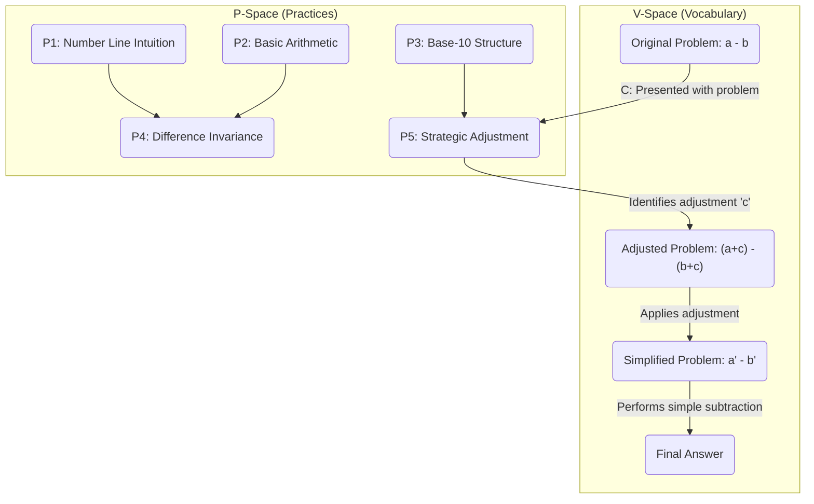
```mermaid
graph TD
    subgraph "V-Space (Vocabulary)"
        V1("Original Problem: a - b")
        V2("Adjusted Problem: (a+c) - (b+c)")
        V3("Simplified Problem: a' - b'")
        V4("Final Answer")
    end

    subgraph "P-Space (Practices)"
        P1("P1: Number Line Intuition")
        P2("P2: Basic Arithmetic")
        P3("P3: Base-10 Structure")
        P4("P4: Difference Invariance")
        P5("P5: Strategic Adjustment")
    end

    %% Relationships
    V1 -- "C: Presented with problem" --> P5
    P5 -- "Identifies adjustment 'c'" --> V2
    V2 -- "Applies adjustment" --> V3
    V3 -- "Performs simple subtraction" --> V4

    %% Foundational Practices
    P1 --> P4
    P2 --> P4
    P3 --> P5
```

### Part A: Meaning-Use Analysis of "Counting On" Strategy

#### 1. Central Material Inferences

The "Counting On" strategy for addition (e.g., solving 5 + 3) is one of the most fundamental calculation strategies. The core material inference is:

*   **If you start at a number *n* and count forward *m* times, you will arrive at the sum *n + m*.**

This strategy treats addition as a form of iterated succession. The process itself—the act of counting—embodies the meaning of addition. The inference is not a conscious, propositionally articulated one; rather, it is enacted in the performance of the counting practice.

#### 2. PP-Necessities and PP-Sufficiencies

*   **PP-Necessities (Prerequisite Practices):**
    *   **P1 (Stable Order Principle):** The ability to recite the number words in a fixed, repeatable order (e.g., "one, two, three...").
    *   **P2 (One-to-One Correspondence):** The ability to assign exactly one number word to each item being counted. In this case, the "items" are the counting acts themselves.
    *   **P3 (Cardinality Principle):** Understanding that the last number word said in a count represents the total number of items.
    *   **P4 (Number Recognition):** The ability to recognize the starting number.

*   **PP-Sufficiencies (Practices Sufficient to Deploy):**
    *   **P5 (Iterated Succession):** The ability to begin at a given number and proceed through the number sequence, one step at a time.
    *   **P6 (Termination Condition):** The ability to keep track of how many steps have been taken and to stop when the required number of steps has been completed.

#### 3. Circumstances and Consequences of Application

*   **Circumstances of Application:**
    *   An addition problem is presented, typically with a small addend (e.g., `n + 2`, `n + 3`).
    *   The practitioner may not have memorized the specific addition fact.

*   **Consequences of Application:**
    *   The practitioner engages in a rhythmic, sequential process of vocal or sub-vocal counting.
    *   The final number uttered in the sequence is taken as the answer to the addition problem.

#### 4. Meaning-Use Diagram (MUD) for "Counting On"

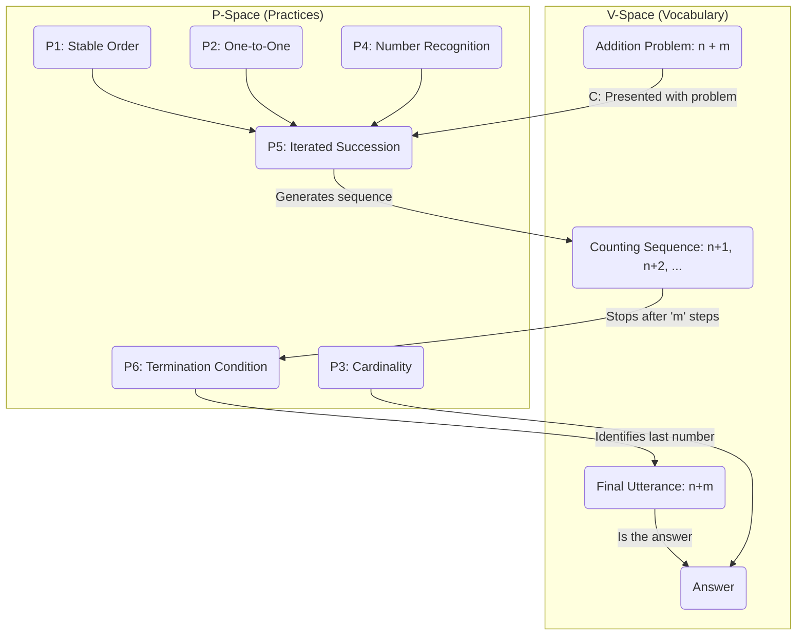
```mermaid
graph TD
    subgraph "V-Space (Vocabulary)"
        V1("Addition Problem: n + m")
        V2("Counting Sequence: n+1, n+2, ...")
        V3("Final Utterance: n+m")
        V4("Answer")
    end

    subgraph "P-Space (Practices)"
        P1("P1: Stable Order")
        P2("P2: One-to-One")
        P3("P3: Cardinality")
        P4("P4: Number Recognition")
        P5("P5: Iterated Succession")
        P6("P6: Termination Condition")
    end

    %% Relationships
    V1 -- "C: Presented with problem" --> P5
    P5 -- "Generates sequence" --> V2
    V2 -- "Stops after 'm' steps" --> P6
    P6 -- "Identifies last number" --> V3
    V3 -- "Is the answer" --> V4

    %% Foundational Practices
    P1 --> P5
    P2 --> P5
    P3 --> V4
    P4 --> P5
```

### Part A: Meaning-Use Analysis of "Rearranging to Make Bases" (RMB)

#### 1. Central Material Inferences

The "Rearranging to Make Bases" (RMB) strategy for addition (e.g., solving 28 + 7) involves a more complex set of inferences than the previous two strategies. The central material inference is a practical enactment of the associative property of addition:

*   **If a number *B* is decomposed into two parts, *K* and *R*, then adding *B* to another number *A* is equivalent to first adding *K* to *A*, and then adding *R* to the result.**

This can be expressed formally as: `A + B = A + (K + R) = (A + K) + R`. The strategy involves seeing the second number (B) not as a monolithic quantity, but as a composite that can be strategically broken apart and recombined to simplify the calculation.

#### 2. PP-Necessities and PP-Sufficiencies

*   **PP-Necessities (Prerequisite Practices):**
    *   **P1 (Counting On):** The ability to perform basic addition, which might be used to solve the final, simplified problem (e.g., `30 + 5`).
    *   **P2 (Base-10 Structure):** A robust understanding of the base-10 system, including identifying the "next base" for a given number.
    *   **P3 (Number Decomposition):** The ability to break a number into two or more parts (e.g., seeing 7 as 2 + 5).

*   **PP-Sufficiencies (Practices Sufficient to Deploy):**
    *   **P4 (Gap Calculation):** The ability to calculate the difference between a number and the next multiple of 10 (e.g., for 28, the gap to 30 is 2).
    *   **P5 (Strategic Decomposition):** The ability to decompose the second number in a way that is useful for the strategy (i.e., using the gap calculated in P4).
    *   **P6 (Re-association):** The ability to mentally re-group the numbers according to the associative principle (i.e., grouping the first number with the "gap" part of the second number).

#### 3. Circumstances and Consequences of Application

*   **Circumstances of Application:**
    *   An addition problem is presented, often one where one of the numbers is close to a multiple of 10 (e.g., 28 + 7).
    *   The practitioner wishes to avoid more cumbersome methods, like carrying over in a written algorithm.

*   **Consequences of Application:**
    *   The original problem is transformed into a three-part addition (`A + K + R`).
    *   The three parts are re-grouped to create a simpler problem, where the first addition results in a multiple of 10.
    *   The final answer is obtained by solving the simplified problem.

#### 4. Meaning-Use Diagram (MUD) for "Rearranging to Make Bases"

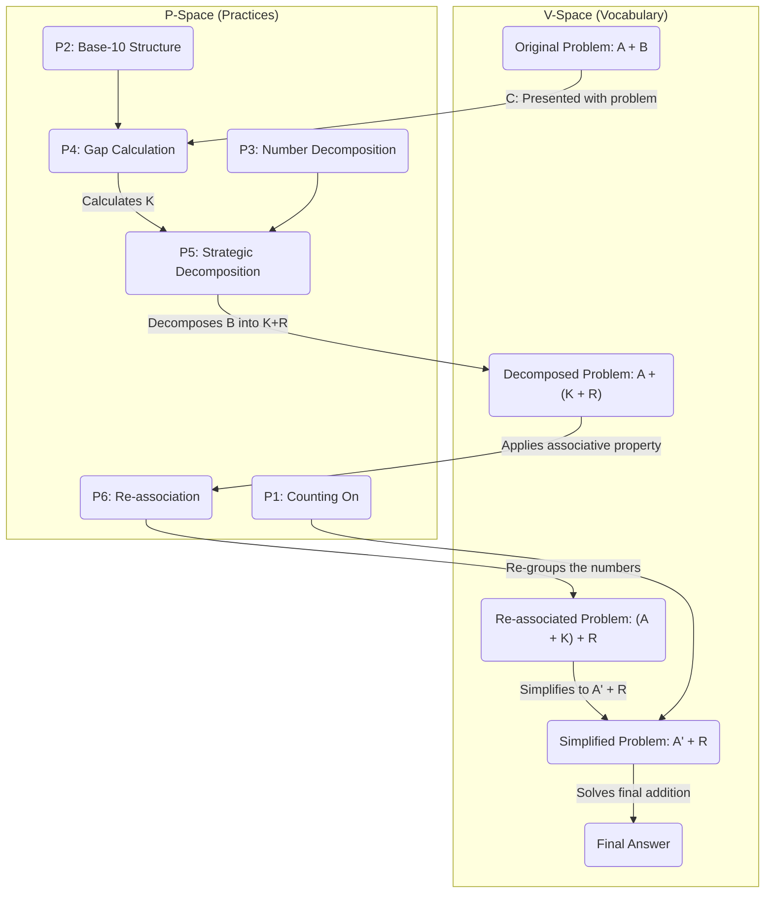
```mermaid
graph TD
    subgraph "V-Space (Vocabulary)"
        V1("Original Problem: A + B")
        V2("Decomposed Problem: A + (K + R)")
        V3("Re-associated Problem: (A + K) + R")
        V4("Simplified Problem: A' + R")
        V5("Final Answer")
    end

    subgraph "P-Space (Practices)"
        P1("P1: Counting On")
        P2("P2: Base-10 Structure")
        P3("P3: Number Decomposition")
        P4("P4: Gap Calculation")
        P5("P5: Strategic Decomposition")
        P6("P6: Re-association")
    end

    %% Relationships
    V1 -- "C: Presented with problem" --> P4
    P4 -- "Calculates K" --> P5
    P5 -- "Decomposes B into K+R" --> V2
    V2 -- "Applies associative property" --> P6
    P6 -- "Re-groups the numbers" --> V3
    V3 -- "Simplifies to A' + R" --> V4
    V4 -- "Solves final addition" --> V5

    %% Foundational Practices
    P1 --> V4
    P2 --> P4
    P3 --> P5
```

### Part B: Analysis of the LX Relation

This part of the analysis evaluates the claim that **"Rearranging to Make Bases is LX for Counting On."** To do this, we'll use Brandom's concept of the LX-relation, where one vocabulary or set of practices is a "Linguistically Elaborated" version of another.

#### 1. The LX-Relation (Elaboration)

A vocabulary V' is LX for a vocabulary V if V' makes explicit the practices that were merely implicit in V. In other words, V' allows you to *say* what you could only *do* when using V. The LX-relation is a key part of Brandom's model of conceptual progress. It's how a community moves from a "knowing-how" (a reliable but un-theorized practice) to a "knowing-that" (a practice that is understood in terms of explicit principles).

To show that "Rearranging" is LX for "Counting On," we need to demonstrate that "Rearranging" provides the conceptual tools to articulate the principles that are implicitly at work in the simpler "Counting On" strategy.

#### 2. "Counting On" as the Implicit Practice

As we saw in the MUA for "Counting On," the strategy is a reliable, but "blind" procedure. A child can learn to "count on" and get the right answer to `5 + 3` by saying "6, 7, 8." The practice works, but it doesn't, on its own, provide the resources to explain *why* it works, other than by re-stating the procedure. The principles of addition (like associativity and decomposition) are not explicitly represented in the strategy itself; they are just part of the background structure of the number system that makes the strategy successful.

The "Counting On" strategy embodies a "knowing-how." The practitioner knows *how* to get the answer, but may not be able to articulate *that* the process is an instantiation of the associative property of addition.

#### 3. "Rearranging" as the Explicit Elaboration

The "Rearranging to Make Bases" (RMB) strategy is fundamentally different. It is not a simple, linear procedure. It is a strategic manipulation of the numbers involved. Consider the steps:

1.  **Decomposition:** The act of breaking `B` into `K + R` is an explicit recognition that numbers are composites.
2.  **Re-association:** The act of re-grouping `A + (K + R)` into `(A + K) + R` is an explicit application of the associative principle.

The RMB strategy is not just about getting the right answer; it's about getting the right answer in a way that is computationally elegant and demonstrates a deeper understanding of the underlying mathematical principles. The vocabulary of RMB—"gap," "decompose," "re-group"—is a meta-vocabulary that allows the practitioner to talk about the *structure* of the addition problem, not just its solution.

#### 4. Conclusion: "Rearranging" is LX for "Counting On"

The claim that "Rearranging to Make Bases is LX for Counting On" is well-founded. Here's why:

*   **RMB makes the implicit explicit:** "Counting On" implicitly relies on the fact that numbers can be decomposed and re-composed. For example, when counting on from 8 by 5, the practitioner implicitly bridges 10 (8+2) and then adds the remaining 3. RMB makes this "bridging" an explicit, strategic act of decomposition and re-association.
*   **RMB provides explanatory power:** A practitioner using RMB can explain *why* `28 + 7` is the same as `30 + 5`. They can appeal to the principles of decomposition and associativity that are made explicit in the strategy. A practitioner using only "Counting On" can only explain their process by re-stating it.
*   **RMB is a conceptual advance:** Moving from "Counting On" to "RMB" is not just learning a new trick. It's learning a new way of seeing numbers—not just as points on a line to be counted, but as structured entities that can be taken apart and put back together in strategic ways.

In Brandomian terms, the "Rearranging to Make Bases" strategy provides the expressive resources to articulate the material inferential proprieties that were merely implicit in the simpler, more primitive practice of "Counting On." It is a clear example of conceptual elaboration.

### Part A: Meaning-Use Analysis of "COBO (Counting On by Bases then Ones)"

#### 1. Central Material Inferences

The "COBO" strategy infers that:

*   **A number can be decomposed into its constituent base parts and a remainder.** (e.g., 34 is three 10s and a 4)
*   **Addition can be performed by sequentially adding these decomposed parts.** (e.g., `28 + 34 = 28 + 10 + 10 + 10 + 4`)

The core inference is that a large addition can be broken down into a series of more manageable smaller additions, organized by place value.

#### 2. PP-Necessities and PP-Sufficiencies

*   **PP-Necessities (Prerequisite Practices):**
    *   **P1 (Counting On):** Needed to perform the final step of adding the ones.
    *   **P2 (Place Value Understanding):** The ability to decompose a number into its base components (e.g., knowing 34 is 3 tens and 4 ones).
    *   **P3 (Counting by Tens):** The ability to count in jumps of 10 from any number (e.g., 28, 38, 48...).

*   **PP-Sufficiencies (Practices Sufficient to Deploy):**
    *   **P4 (Strategic Decomposition):** The ability to decompose the second number into bases and ones for the purpose of addition.
    *   **P5 (Iterated Base-Jumping):** The practice of repeatedly adding the base value.
    *   **P6 (Sequential Processing):** The ability to manage the two-stage process: first adding the bases, then adding the ones.

#### 3. Circumstances and Consequences of Application

*   **Circumstances of Application:**
    *   An addition problem `A + B` is presented, where `B` is large enough to make simple "Counting On" inefficient.
    *   The practitioner has a good grasp of place value.

*   **Consequences of Application:**
    *   The addition is performed in two distinct phases: base jumps and then unit counts.
    *   This is more efficient than counting by ones, but less abstract than strategies like "Rearranging to Make Bases".
    *   The final result is the sum of the original numbers.

#### 4. Meaning-Use Diagram (MUD) for "COBO"

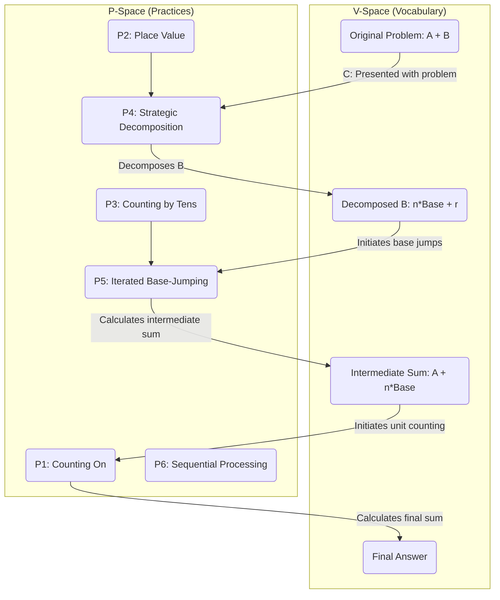
```mermaid
graph TD
    subgraph "V-Space (Vocabulary)"
        V1("Original Problem: A + B")
        V2("Decomposed B: n*Base + r")
        V3("Intermediate Sum: A + n*Base")
        V4("Final Answer")
    end

    subgraph "P-Space (Practices)"
        P1("P1: Counting On")
        P2("P2: Place Value")
        P3("P3: Counting by Tens")
        P4("P4: Strategic Decomposition")
        P5("P5: Iterated Base-Jumping")
        P6("P6: Sequential Processing")
    end

    %% Relationships
    V1 -- "C: Presented with problem" --> P4
    P4 -- "Decomposes B" --> V2
    V2 -- "Initiates base jumps" --> P5
    P5 -- "Calculates intermediate sum" --> V3
    V3 -- "Initiates unit counting" --> P1
    P1 -- "Calculates final sum" --> V4

    %% Foundational Practices
    P2 --> P4
    P3 --> P5
```

### Part A: Meaning-Use Analysis of "Rounding and Adjusting (Addition)"

#### 1. Central Material Inferences

The "Rounding and Adjusting" strategy infers that:

*   **An addition problem can be temporarily simplified by rounding one of the addends to a "nicer" number (a multiple of 10).**
*   **To maintain the equality, any amount added during rounding must be subtracted later.**

The core inference is a practical application of the principle of compensation: `A + B = (A + K) + B - K`. The strategy involves a deliberate, temporary transformation of the problem into an easier form, followed by a corrective adjustment.

#### 2. PP-Necessities and PP-Sufficiencies

*   **PP-Necessities (Prerequisite Practices):**
    *   **P1 (Basic Addition/Subtraction):** Needed to perform the addition with the rounded number and the final adjustment.
    *   **P2 (Base-10 Structure):** Understanding of bases and how to round a number to the nearest base.
    *   **P3 (Compensation Principle):** A basic intuition that if you change a number, you have to do something else to "make up for it".

*   **PP-Sufficiencies (Practices Sufficient to Deploy):**
    *   **P4 (Strategic Rounding):** The ability to identify an addend that is close to a base and calculate the amount needed to round it up.
    *   **P5 (Problem Transformation):** The ability to perform the simplified addition.
    *   **P6 (Compensatory Adjustment):** The ability to remember the rounding amount and subtract it from the intermediate sum to get the final answer.

#### 3. Circumstances and Consequences of Application

*   **Circumstances of Application:**
    *   An addition problem is presented where one of the numbers is close to a multiple of 10 (e.g., 29 + 17, 48 + 23).
    *   The practitioner wants to simplify the calculation by working with a round number.

*   **Consequences of Application:**
    *   The original problem is transformed into a simpler addition followed by a subtraction.
    *   This can be more efficient than strategies that involve carrying over, especially if the rounding amount is small.
    *   The final result is the sum of the original numbers.

#### 4. Meaning-Use Diagram (MUD) for "Rounding and Adjusting (Addition)"

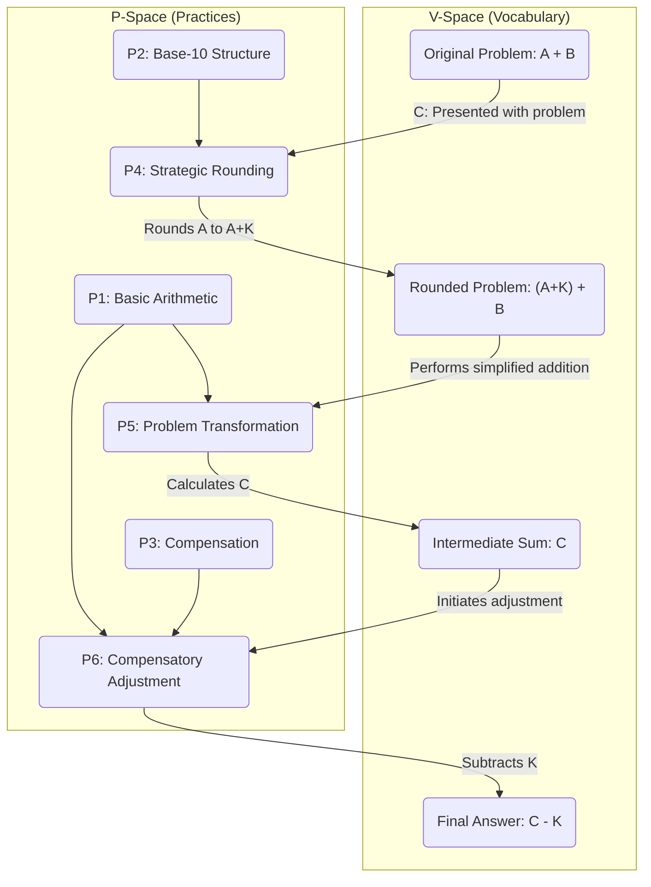
```mermaid
graph TD
    subgraph "V-Space (Vocabulary)"
        V1("Original Problem: A + B")
        V2("Rounded Problem: (A+K) + B")
        V3("Intermediate Sum: C")
        V4("Final Answer: C - K")
    end

    subgraph "P-Space (Practices)"
        P1("P1: Basic Arithmetic")
        P2("P2: Base-10 Structure")
        P3("P3: Compensation")
        P4("P4: Strategic Rounding")
        P5("P5: Problem Transformation")
        P6("P6: Compensatory Adjustment")
    end

    %% Relationships
    V1 -- "C: Presented with problem" --> P4
    P4 -- "Rounds A to A+K" --> V2
    V2 -- "Performs simplified addition" --> P5
    P5 -- "Calculates C" --> V3
    V3 -- "Initiates adjustment" --> P6
    P6 -- "Subtracts K" --> V4

    %% Foundational Practices
    P1 --> P5
    P1 --> P6
    P2 --> P4
    P3 --> P6
```
### Part A: Meaning-Use Analysis of "Chunking (Addition)"

#### 1. Central Material Inferences

The "Chunking" strategy for addition infers that:

*   **An addend can be decomposed into convenient "chunks," typically based on place value (e.g., tens and ones).**
*   **These chunks can be added sequentially to the other addend.**

The core inference is that addition is associative over decomposition: `A + (B1 + B2 + ...)` is equivalent to `((A + B1) + B2) + ...`. The "chunks" are chosen strategically to simplify the series of additions, often by prioritizing larger place values.

#### 2. PP-Necessities and PP-Sufficiencies

*   **PP-Necessities (Prerequisite Practices):**
    *   **P1 (Basic Addition):** Needed to add the chunks together.
    *   **P2 (Number Decomposition):** The ability to break a number into parts (e.g., 34 is 30 and 4).
    *   **P3 (Place Value Understanding):** To guide the decomposition into meaningful (base-ten) chunks.

*   **PP-Sufficiencies (Practices Sufficient to Deploy):**
    *   **P4 (Strategic Chunking):** The ability to decompose an addend into chunks that are easy to work with (e.g., multiples of 10).
    *   **P5 (Iterative Addition):** The practice of sequentially adding the chunks to the running total.
    *   **P6 (Working Memory):** The ability to keep track of the intermediate sums and the remaining chunks to be added.

#### 3. Circumstances and Consequences of Application

*   **Circumstances of Application:**
    *   An addition problem is presented, especially one with multi-digit numbers.
    *   The practitioner is comfortable with decomposing numbers and performing a series of additions.

*   **Consequences of Application:**
    *   The addition problem is transformed into a series of simpler additions.
    *   This avoids the formal algorithm of carrying and allows for more mental flexibility.
    *   The final result is the sum of the original numbers.

#### 4. Meaning-Use Diagram (MUD) for "Chunking (Addition)"

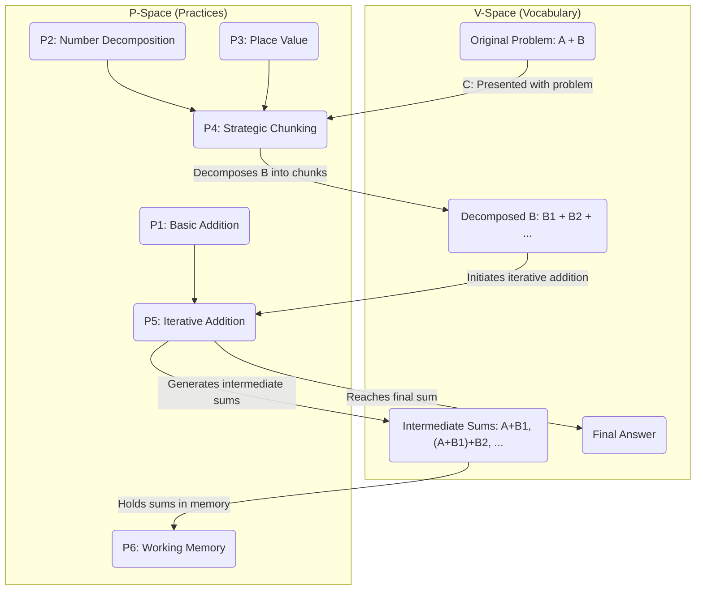
```mermaid
graph TD
    subgraph "V-Space (Vocabulary)"
        V1("Original Problem: A + B")
        V2("Decomposed B: B1 + B2 + ...")
        V3("Intermediate Sums: A+B1, (A+B1)+B2, ...")
        V4("Final Answer")
    end

    subgraph "P-Space (Practices)"
        P1("P1: Basic Addition")
        P2("P2: Number Decomposition")
        P3("P3: Place Value")
        P4("P4: Strategic Chunking")
        P5("P5: Iterative Addition")
        P6("P6: Working Memory")
    end

    %% Relationships
    V1 -- "C: Presented with problem" --> P4
    P4 -- "Decomposes B into chunks" --> V2
    V2 -- "Initiates iterative addition" --> P5
    P5 -- "Generates intermediate sums" --> V3
    V3 -- "Holds sums in memory" --> P6
    P5 -- "Reaches final sum" --> V4


    %% Foundational Practices
    P1 --> P5
    P2 --> P4
    P3 --> P4
```
### Part A: Meaning-Use Analysis of "Subtraction Chunking (Backwards by Part)"

#### 1. Central Material Inferences

The "Subtraction Chunking (Backwards by Part)" strategy infers that:

*   **The number being subtracted (the subtrahend) can be decomposed into convenient chunks (e.g., tens and ones).**
*   **These chunks can be subtracted sequentially from the starting number (the minuend).**

The core inference is a practical application of the principle that `M - (S1 + S2) = (M - S1) - S2`. The problem is transformed from a single, complex subtraction into a series of simpler subtractions.

#### 2. PP-Necessities and PP-Sufficiencies

*   **PP-Necessities (Prerequisite Practices):**
    *   **P1 (Basic Subtraction):** Needed to subtract the individual chunks.
    *   **P2 (Number Decomposition):** The ability to break the subtrahend into parts.
    *   **P3 (Place Value Understanding):** To guide the decomposition into meaningful chunks (e.g., 47 is 40 and 7).

*   **PP-Sufficiencies (Practices Sufficient to Deploy):**
    *   **P4 (Strategic Chunking):** The ability to decompose the subtrahend into chunks that are easy to subtract.
    *   **P5 (Iterative Subtraction):** The practice of sequentially subtracting the chunks from the running total.
    *   **P6 (Working Memory):** The ability to hold the intermediate results in memory as the subtraction proceeds.

#### 3. Circumstances and Consequences of Application

*   **Circumstances of Application:**
    *   A subtraction problem is presented, especially one with multi-digit numbers where borrowing might be seen as difficult.
    *   The practitioner is comfortable with decomposing numbers and performing a series of subtractions.

*   **Consequences of Application:**
    *   The subtraction problem is transformed into a multi-step process of smaller subtractions.
    *   This strategy avoids the borrowing algorithm and allows for mental flexibility.
    *   The final result is the difference between the original numbers.

#### 4. Meaning-Use Diagram (MUD) for "Subtraction Chunking (Backwards by Part)"

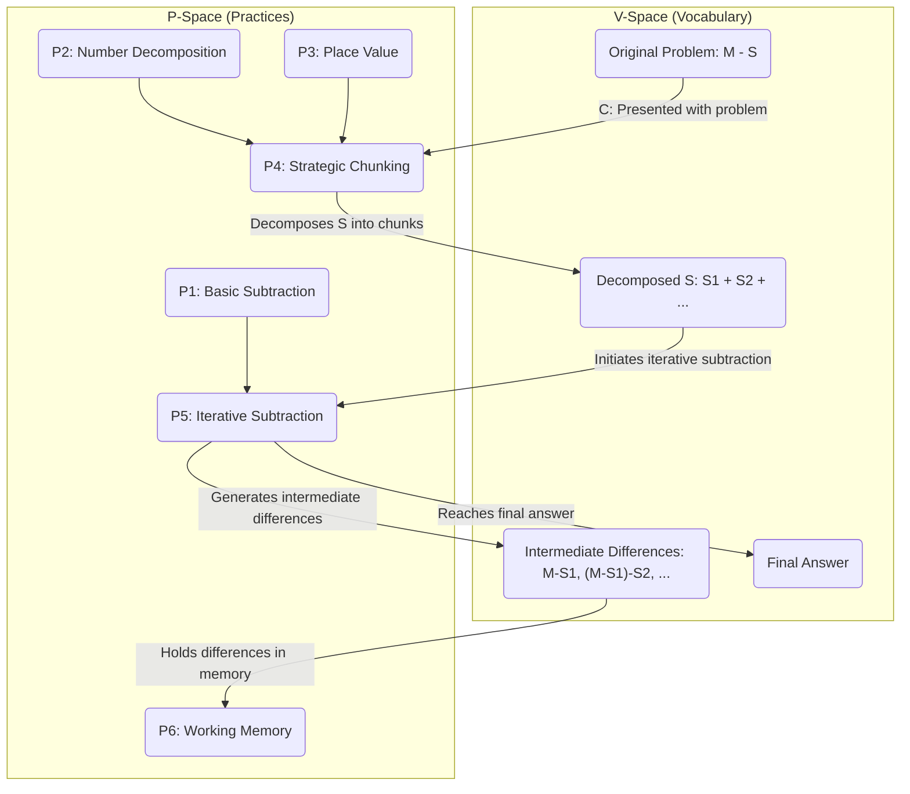
```mermaid
graph TD
    subgraph "V-Space (Vocabulary)"
        V1("Original Problem: M - S")
        V2("Decomposed S: S1 + S2 + ...")
        V3("Intermediate Differences: M-S1, (M-S1)-S2, ...")
        V4("Final Answer")
    end

    subgraph "P-Space (Practices)"
        P1("P1: Basic Subtraction")
        P2("P2: Number Decomposition")
        P3("P3: Place Value")
        P4("P4: Strategic Chunking")
        P5("P5: Iterative Subtraction")
        P6("P6: Working Memory")
    end

    %% Relationships
    V1 -- "C: Presented with problem" --> P4
    P4 -- "Decomposes S into chunks" --> V2
    V2 -- "Initiates iterative subtraction" --> P5
    P5 -- "Generates intermediate differences" --> V3
    V3 -- "Holds differences in memory" --> P6
    P5 -- "Reaches final answer" --> V4

    %% Foundational Practices
    P1 --> P5
    P2 --> P4
    P3 --> P4
```
### Part A: Meaning-Use Analysis of "Subtraction Chunking (Forwards from Part)"

#### 1. Central Material Inferences

The "Subtraction Chunking (Forwards from Part)" strategy, also known as "counting up," is based on a fundamental reframing of subtraction. The core inferences are:

*   **A subtraction problem `M - S` can be understood as a "missing addend" problem `S + ? = M`.**
*   **The missing addend (the difference) can be found by accumulating the "jumps" required to get from S to M.**

This strategy infers that subtraction is equivalent to finding the distance between two numbers on a number line, a distance that can be measured by counting up from the smaller number to the larger one.

#### 2. PP-Necessities and PP-Sufficiencies

*   **PP-Necessities (Prerequisite Practices):**
    *   **P1 (Addition/Counting On):** The core of the strategy is addition.
    *   **P2 (Inverse Relationship of Add/Sub):** A conceptual understanding that subtraction and addition are inverse operations.
    *   **P3 (Number Decomposition):** To make strategic jumps (e.g., knowing to jump to the next ten).

*   **PP-Sufficiencies (Practices Sufficient to Deploy):**
    *   **P4 (Problem Reframing):** The ability to transform the subtraction problem into a "missing addend" problem.
    *   **P5 (Strategic Jumps):** The ability to plan and execute a series of jumps from S to M, often using multiples of 10.
    *   **P6 (Accumulating the Difference):** The ability to keep a running total of the jumps made, which will be the final answer.

#### 3. Circumstances and Consequences of Application

*   **Circumstances of Application:**
    *   A subtraction problem is presented, especially one where the minuend and subtrahend are relatively close, making "counting up" efficient.
    *   This strategy is also common in situations involving money (e.g., making change).

*   **Consequences of Application:**
    *   The subtraction problem is transformed into a series of additions.
    *   This can feel more intuitive for some learners as it avoids the "take away" model of subtraction.
    *   The final answer is the sum of the accumulated jumps.

#### 4. Meaning-Use Diagram (MUD) for "Subtraction Chunking (Forwards from Part)"

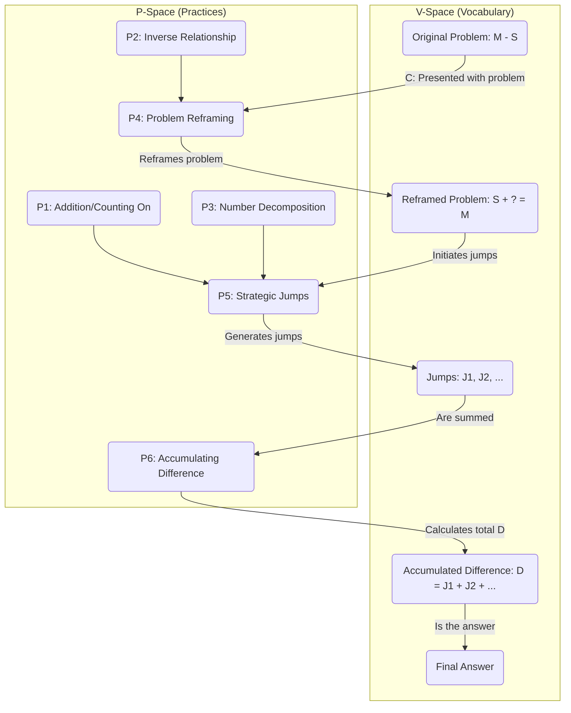
```mermaid
graph TD
    subgraph "V-Space (Vocabulary)"
        V1("Original Problem: M - S")
        V2("Reframed Problem: S + ? = M")
        V3("Jumps: J1, J2, ...")
        V4("Accumulated Difference: D = J1 + J2 + ...")
        V5("Final Answer")
    end

    subgraph "P-Space (Practices)"
        P1("P1: Addition/Counting On")
        P2("P2: Inverse Relationship")
        P3("P3: Number Decomposition")
        P4("P4: Problem Reframing")
        P5("P5: Strategic Jumps")
        P6("P6: Accumulating Difference")
    end

    %% Relationships
    V1 -- "C: Presented with problem" --> P4
    P4 -- "Reframes problem" --> V2
    V2 -- "Initiates jumps" --> P5
    P5 -- "Generates jumps" --> V3
    V3 -- "Are summed" --> P6
    P6 -- "Calculates total D" --> V4
    V4 -- "Is the answer" --> V5

    %% Foundational Practices
    P1 --> P5
    P2 --> P4
    P3 --> P5
```
### Part A: Meaning-Use Analysis of "Subtraction Chunking (Backwards to Part)"

#### 1. Central Material Inferences

The "Subtraction Chunking (Backwards to Part)" strategy is another take on subtraction as finding a distance. The core inferences are:

*   **The difference between two numbers, `M` and `S`, can be found by starting at `M` and counting backwards to `S` in strategic jumps.**
*   **The total of these backwards jumps is equivalent to the difference `M - S`.**

This strategy also treats subtraction as finding the distance between two points, but by moving from the larger number to the smaller one.

#### 2. PP-Necessities and PP-Sufficiencies

*   **PP-Necessities (Prerequisite Practices):**
    *   **P1 (Basic Subtraction):** Needed to perform the jumps.
    *   **P2 (Number Line Intuition):** A strong sense of the number line to navigate backwards.
    *   **P3 (Place Value Understanding):** To identify strategic "landing spots" (multiples of 10).

*   **PP-Sufficiencies (Practices Sufficient to Deploy):**
    *   **P4 (Goal-Oriented Jumps):** The ability to plan and execute a series of backward jumps from M with the goal of landing on S.
    *   **P5 (Accumulating the Difference):** The ability to keep a running total of the jumps made.
    *   **P6 (Working Memory):** To hold the current position on the number line and the accumulated difference simultaneously.

#### 3. Circumstances and Consequences of Application

*   **Circumstances of Application:**
    *   A subtraction problem is presented. This strategy is flexible and can be used for many types of problems.
    *   The practitioner is comfortable with counting backwards and has a good mental model of the number line.

*   **Consequences of Application:**
    *   The subtraction problem is transformed into a series of smaller, more manageable subtractions.
    *   This provides another alternative to the standard borrowing algorithm.
    *   The final answer is the sum of the accumulated backward jumps.

#### 4. Meaning-Use Diagram (MUD) for "Subtraction Chunking (Backwards to Part)"

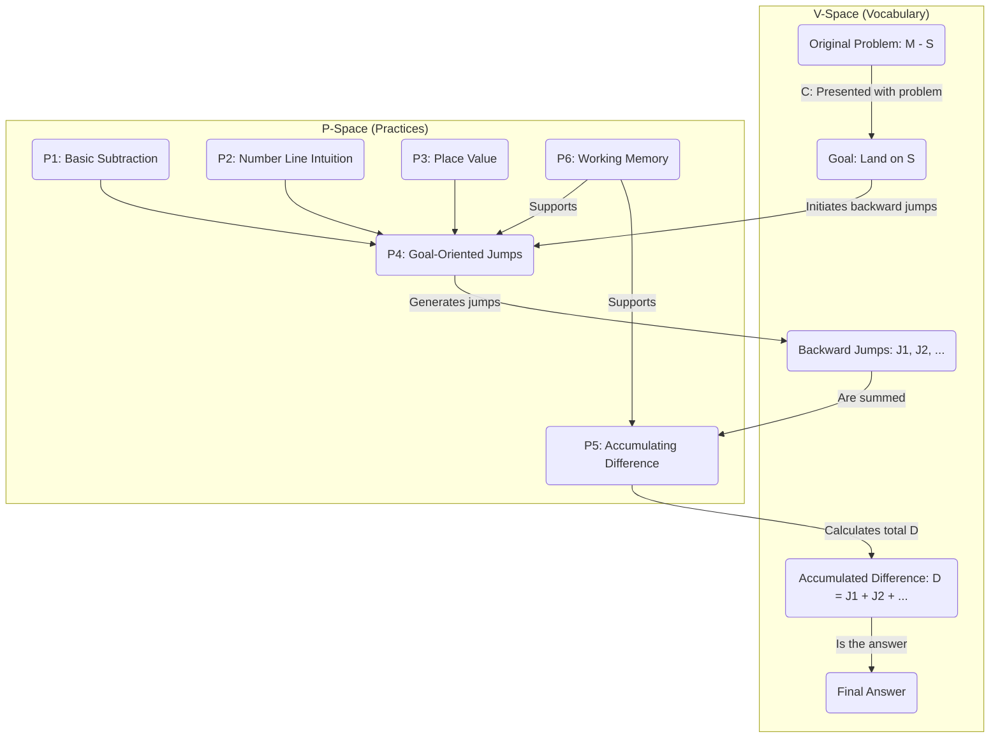
```mermaid
graph TD
    subgraph "V-Space (Vocabulary)"
        V1("Original Problem: M - S")
        V2("Goal: Land on S")
        V3("Backward Jumps: J1, J2, ...")
        V4("Accumulated Difference: D = J1 + J2 + ...")
        V5("Final Answer")
    end

    subgraph "P-Space (Practices)"
        P1("P1: Basic Subtraction")
        P2("P2: Number Line Intuition")
        P3("P3: Place Value")
        P4("P4: Goal-Oriented Jumps")
        P5("P5: Accumulating Difference")
        P6("P6: Working Memory")
    end

    %% Relationships
    V1 -- "C: Presented with problem" --> V2
    V2 -- "Initiates backward jumps" --> P4
    P4 -- "Generates jumps" --> V3
    V3 -- "Are summed" --> P5
    P5 -- "Calculates total D" --> V4
    V4 -- "Is the answer" --> V5

    %% Foundational Practices
    P1 --> P4
    P2 --> P4
    P3 --> P4
    P6 -- "Supports" --> P4 & P5
```
### Part A: Meaning-Use Analysis of "Subtraction COBO (Missing Addend)"

#### 1. Central Material Inferences

This strategy reframes subtraction as a "missing addend" problem. The core inferences are:

*   **A subtraction `M - S` is equivalent to the missing addend problem `S + ? = M`.**
*   **The distance from S to M can be efficiently covered by first taking large, structured jumps (bases/tens) and then smaller jumps (ones).**
*   **The sum of the accumulated jumps (the distance covered) is the solution to the original subtraction problem.**

This strategy makes the "counting up" approach more systematic by explicitly using the base-ten structure of the number system to guide the jumps.

#### 2. PP-Necessities and PP-Sufficiencies

*   **PP-Necessities (Prerequisite Practices):**
    *   **P1 (Inverse Relationship of Add/Sub):** The ability to reframe subtraction as a missing addend problem.
    *   **P2 (Place Value / Base-10 Structure):** To understand the concept of jumping by tens.
    *   **P3 (Counting by Tens):** The ability to add 10 to any number.
    *   **P4 (Counting On):** To handle the final "ones" jumps.

*   **PP-Sufficiencies (Practices Sufficient to Deploy):**
    *   **P5 (Problem Reframing):** The ability to set up the problem as `S + ? = M`.
    *   **P6 (Iterated Base-Jumping):** The practice of repeatedly adding 10 until the next jump would exceed the target (M).
    *   **P7 (Final Ones Count):** The practice of counting on by ones to cover the remaining distance.
    *   **P8 (Accumulating the Difference):** Keeping a running total of all the jumps (both base and ones) made.

#### 3. Circumstances and Consequences of Application

*   **Circumstances of Application:**
    *   A subtraction problem `M - S` is presented.
    *   This strategy is particularly effective when the difference between M and S is large enough that counting by ones would be tedious, but the practitioner wants to use an additive approach.

*   **Consequences of Application:**
    *   The subtraction problem is transformed into a structured series of additions (base jumps followed by unit counts).
    *   This avoids "borrowing" and can feel more intuitive, as it builds up from a smaller number to a larger one.
    *   The final answer is the accumulated total of the jumps.

#### 4. Meaning-Use Diagram (MUD) for "Subtraction COBO (Missing Addend)"

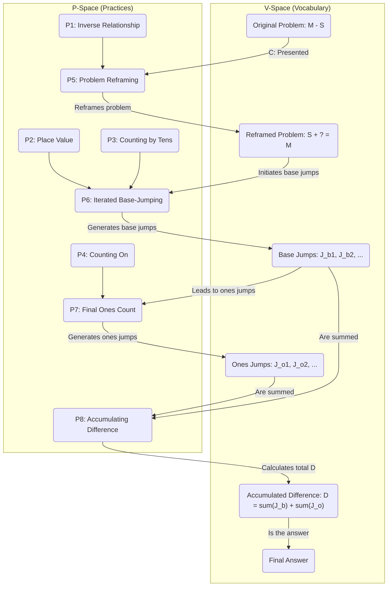
```mermaid
graph TD
    subgraph "V-Space (Vocabulary)"
        V1("Original Problem: M - S")
        V2("Reframed Problem: S + ? = M")
        V3("Base Jumps: J_b1, J_b2, ...")
        V4("Ones Jumps: J_o1, J_o2, ...")
        V5("Accumulated Difference: D = sum(J_b) + sum(J_o)")
        V6("Final Answer")
    end

    subgraph "P-Space (Practices)"
        P1("P1: Inverse Relationship")
        P2("P2: Place Value")
        P3("P3: Counting by Tens")
        P4("P4: Counting On")
        P5("P5: Problem Reframing")
        P6("P6: Iterated Base-Jumping")
        P7("P7: Final Ones Count")
        P8("P8: Accumulating Difference")
    end

    %% Relationships
    V1 -- "C: Presented" --> P5
    P5 -- "Reframes problem" --> V2
    V2 -- "Initiates base jumps" --> P6
    P6 -- "Generates base jumps" --> V3
    V3 -- "Leads to ones jumps" --> P7
    P7 -- "Generates ones jumps" --> V4
    V3 & V4 -- "Are summed" --> P8
    P8 -- "Calculates total D" --> V5
    V5 -- "Is the answer" --> V6

    %% Foundational Practices
    P1 --> P5
    P2 --> P6
    P3 --> P6
    P4 --> P7
```
### Part A: Meaning-Use Analysis of "Subtraction CBBO (Counting Back by Bases and Ones)"

#### 1. Central Material Inferences

This strategy is a structured form of "take-away" subtraction. The core inferences are:

*   **The number being subtracted (the subtrahend, S) can be decomposed into its constituent base parts and a remainder.** (e.g., 25 is two 10s and a 5)
*   **Subtraction can be performed by sequentially taking away these decomposed parts from the minuend (M).** (e.g., `81 - 25` is performed as `(81 - 10) - 10` and then `- 5`)

This strategy infers that a large subtraction can be broken down into a series of more manageable smaller subtractions, organized by place value.

#### 2. PP-Necessities and PP-Sufficiencies

*   **PP-Necessities (Prerequisite Practices):**
    *   **P1 (Place Value Understanding):** The ability to decompose the subtrahend into its base components.
    *   **P2 (Counting Back by Tens):** The ability to subtract 10 from any number.
    *   **P3 (Counting Back by Ones):** The ability to perform simple subtraction of single-digit numbers.

*   **PP-Sufficiencies (Practices Sufficient to Deploy):**
    *   **P4 (Strategic Decomposition):** The ability to decompose the subtrahend `S` into bases and ones for the purpose of subtraction.
    *   **P5 (Iterated Base Subtraction):** The practice of repeatedly subtracting the base value from the minuend `M`.
    *   **P6 (Final Ones Subtraction):** The practice of subtracting the remaining ones from the intermediate result.
    *   **P7 (Sequential Processing):** The ability to manage the two-stage process: first subtracting bases, then subtracting ones.

#### 3. Circumstances and Consequences of Application

*   **Circumstances of Application:**
    *   A subtraction problem `M - S` is presented.
    *   This strategy is a natural extension for learners who are comfortable with place value and counting backwards. It's a more structured alternative to simple "take-away" counting.

*   **Consequences of Application:**
    *   The subtraction is performed in two distinct phases: subtracting bases and then subtracting units.
    *   It directly models the "take-away" meaning of subtraction, which can be very intuitive.
    *   The final result is the difference between the two numbers.

#### 4. Meaning-Use Diagram (MUD) for "Subtraction CBBO (Counting Back)"

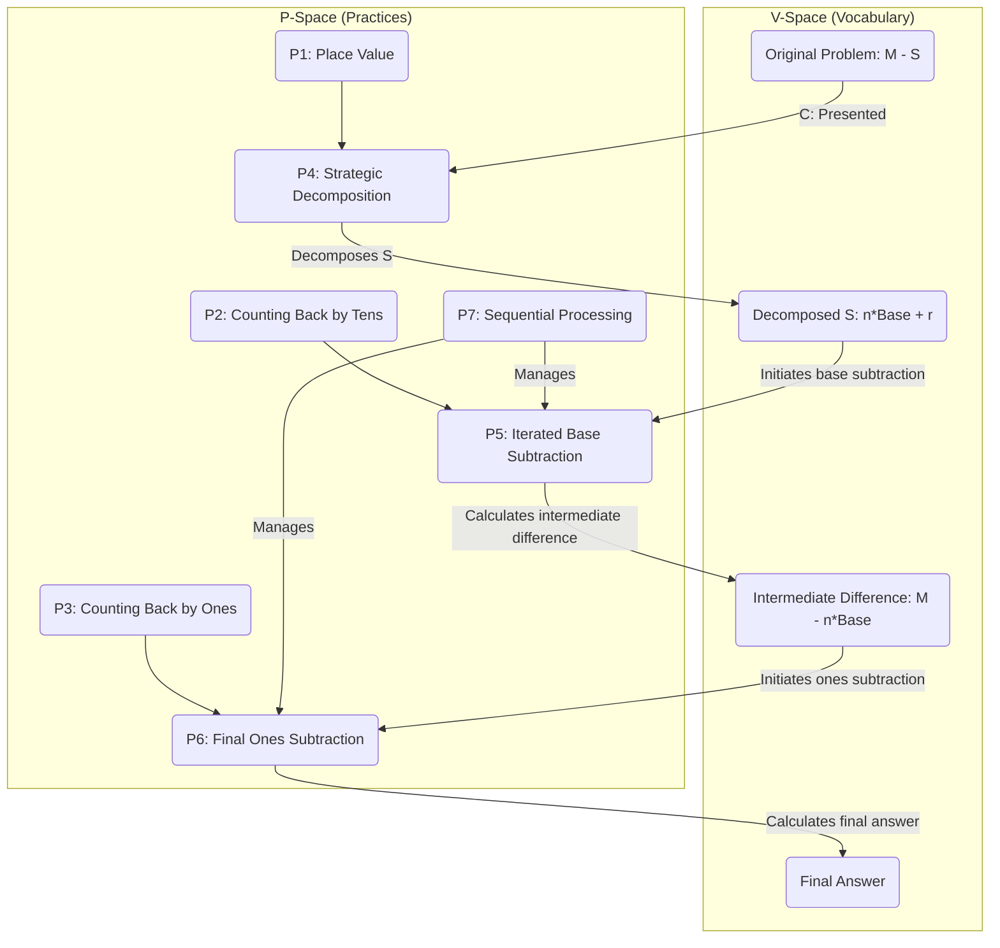
```mermaid
graph TD
    subgraph "V-Space (Vocabulary)"
        V1("Original Problem: M - S")
        V2("Decomposed S: n*Base + r")
        V3("Intermediate Difference: M - n*Base")
        V4("Final Answer")
    end

    subgraph "P-Space (Practices)"
        P1("P1: Place Value")
        P2("P2: Counting Back by Tens")
        P3("P3: Counting Back by Ones")
        P4("P4: Strategic Decomposition")
        P5("P5: Iterated Base Subtraction")
        P6("P6: Final Ones Subtraction")
        P7("P7: Sequential Processing")
    end

    %% Relationships
    V1 -- "C: Presented" --> P4
    P4 -- "Decomposes S" --> V2
    V2 -- "Initiates base subtraction" --> P5
    P5 -- "Calculates intermediate difference" --> V3
    V3 -- "Initiates ones subtraction" --> P6
    P6 -- "Calculates final answer" --> V4

    %% Foundational Practices
    P1 --> P4
    P2 --> P5
    P3 --> P6
    P7 -- "Manages" --> P5 & P6
```
### Part A: Meaning-Use Analysis of "Subtraction Decomposition (Borrowing)"

#### 1. Central Material Inferences

The "Subtraction Decomposition (Borrowing)" strategy, the standard algorithm, is a highly proceduralized application of place value concepts. The core inferences are:

*   **Numbers can be decomposed and recomposed across place values.** (e.g., a "ten" can be decomposed into ten "ones").
*   **Subtraction can be performed column by column, from right to left.**
*   **If a digit in the minuend is smaller than the corresponding digit in the subtrahend, a "borrow" from the next higher place value is necessary and justified.**

This strategy infers that the structure of the base-ten system allows for a reliable, step-by-step procedure for subtraction.

#### 2. PP-Necessities and PP-Sufficiencies

*   **PP-Necessities (Prerequisite Practices):**
    *   **P1 (Basic Subtraction Facts):** To subtract the digits in each column.
    *   **P2 (Place Value Alignment):** The ability to write the problem vertically, aligning the place values correctly.
    *   **P3 (Conceptual Decomposition):** A basic understanding that a ten is also ten ones, a hundred is ten tens, etc.

*   **PP-Sufficiencies (Practices Sufficient to Deploy):**
    *   **P4 (Algorithmic Procedure):** The ability to follow the rigid, step-by-step procedure of the algorithm (right to left, borrow when needed).
    *   **P5 (Borrowing/Decomposition Practice):** The practical ability to decrement the higher place value and increment the lower one.
    *   **P6 (Columnar Subtraction):** The practice of subtracting the digits within each column independently.

#### 3. Circumstances and Consequences of Application

*   **Circumstances of Application:**
    *   A subtraction problem is presented, often in a formal, written context (e.g., a worksheet).
    *   This is the default strategy taught in many educational systems.

*   **Consequences of Application:**
    *   The problem is solved in a reliable, though often mechanical, way.
    *   For many learners, the underlying conceptual basis (the decomposition) can become obscured, leading to rote memorization of the procedure and "buggy" algorithms when the procedure is forgotten.
    *   The final result is the difference between the two numbers.

#### 4. Meaning-Use Diagram (MUD) for "Subtraction Decomposition (Borrowing)"

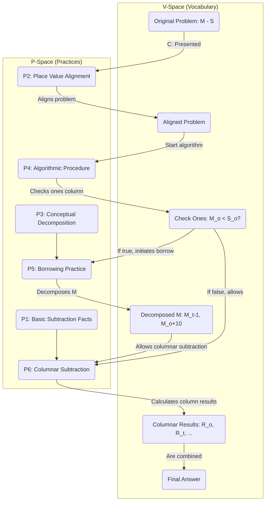
```mermaid
graph TD
    subgraph "V-Space (Vocabulary)"
        V1("Original Problem: M - S")
        V2("Aligned Problem")
        V3("Check Ones: M_o < S_o?")
        V4("Decomposed M: M_t-1, M_o+10")
        V5("Columnar Results: R_o, R_t, ...")
        V6("Final Answer")
    end

    subgraph "P-Space (Practices)"
        P1("P1: Basic Subtraction Facts")
        P2("P2: Place Value Alignment")
        P3("P3: Conceptual Decomposition")
        P4("P4: Algorithmic Procedure")
        P5("P5: Borrowing Practice")
        P6("P6: Columnar Subtraction")
    end

    %% Relationships
    V1 -- "C: Presented" --> P2
    P2 -- "Aligns problem" --> V2
    V2 -- "Start algorithm" --> P4
    P4 -- "Checks ones column" --> V3
    V3 -- "If true, initiates borrow" --> P5
    P5 -- "Decomposes M" --> V4
    V4 -- "Allows columnar subtraction" --> P6
    V3 -- "If false, allows" --> P6
    P6 -- "Calculates column results" --> V5
    V5 -- "Are combined" --> V6


    %% Foundational Practices
    P1 --> P6
    P3 --> P5
```
### Part A: Meaning-Use Analysis of "Conversion to Bases and Ones (CBO Multiplication)"

#### 1. Central Material Inferences

This strategy is a multiplicative form of "rounding and adjusting". The core inferences are:

*   **A multiplication problem `A x B` can be simplified by rounding one of the factors (say, B) to the nearest base (B').**
*   **This creates a simpler problem (`A x B'`), but the result must be adjusted to compensate for the rounding.**
*   **The adjustment is itself a multiplication problem (`A` times the rounding amount `K`), which is then added or subtracted from the intermediate product.**

The core inference is a practical application of the distributive property of multiplication over addition/subtraction: `A x B = A x (B' +/- K) = (A x B') +/- (A x K)`.

#### 2. PP-Necessities and PP-Sufficiencies

*   **PP-Necessities (Prerequisite Practices):**
    *   **P1 (Basic Multiplication/Addition/Subtraction):** Needed to perform the simplified multiplication and the final adjustment.
    *   **P2 (Rounding Skills):** To round one of the factors to a nearby base.
    *   **P3 (Distributive Principle):** A conceptual understanding that multiplication distributes over addition/subtraction.

*   **PP-Sufficiencies (Practices Sufficient to Deploy):**
    *   **P4 (Strategic Rounding):** The ability to identify a factor that is close to a base and round it, keeping track of the difference `K`.
    *   **P5 (Problem Transformation):** The ability to perform the simplified multiplication `A x B'`.
    *   **P6 (Compensatory Calculation):** The ability to calculate the total adjustment needed (`A x K`).
    *   **P7 (Final Adjustment):** The ability to correctly add or subtract the compensation from the intermediate product.

#### 3. Circumstances and Consequences of Application

*   **Circumstances of Application:**
    *   A multiplication problem is presented where one factor is close to a multiple of 10 (e.g., `7 x 19`, `6 x 48`).
    *   The practitioner is comfortable with the distributive property and can manage a multi-step calculation.

*   **Consequences of Application:**
    *   The original problem is transformed into a simpler multiplication followed by an addition or subtraction.
    *   This can be a very powerful strategy for mental math, avoiding the need for a written algorithm.
    *   The final result is the product of the original numbers.

#### 4. Meaning-Use Diagram (MUD) for "Conversion to Bases and Ones (CBO Multiplication)"

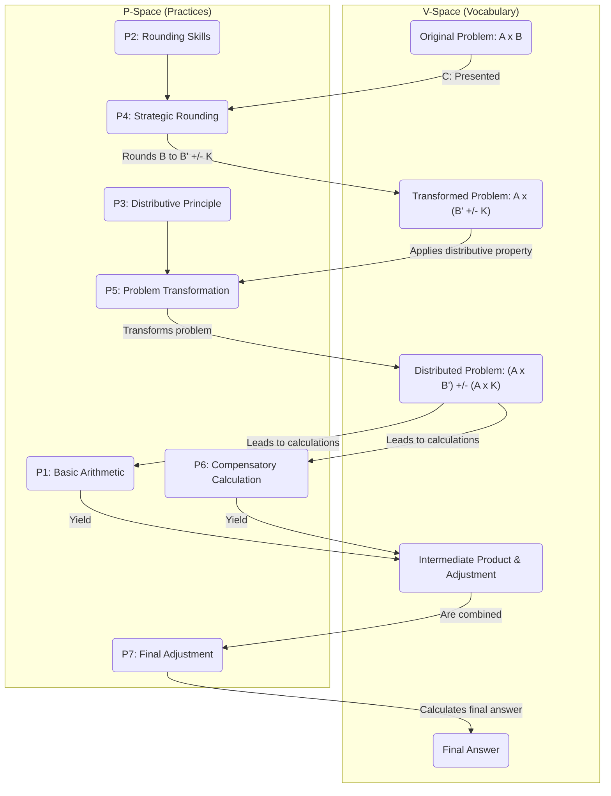
```mermaid
graph TD
    subgraph "V-Space (Vocabulary)"
        V1("Original Problem: A x B")
        V2("Transformed Problem: A x (B' +/- K)")
        V3("Distributed Problem: (A x B') +/- (A x K)")
        V4("Intermediate Product & Adjustment")
        V5("Final Answer")
    end

    subgraph "P-Space (Practices)"
        P1("P1: Basic Arithmetic")
        P2("P2: Rounding Skills")
        P3("P3: Distributive Principle")
        P4("P4: Strategic Rounding")
        P5("P5: Problem Transformation")
        P6("P6: Compensatory Calculation")
        P7("P7: Final Adjustment")
    end

    %% Relationships
    V1 -- "C: Presented" --> P4
    P4 -- "Rounds B to B' +/- K" --> V2
    V2 -- "Applies distributive property" --> P5
    P5 -- "Transforms problem" --> V3
    V3 -- "Leads to calculations" --> P1 & P6
    P1 & P6 -- "Yield" --> V4
    V4 -- "Are combined" --> P7
    P7 -- "Calculates final answer" --> V5

    %% Foundational Practices
    P2 --> P4
    P3 --> P5
```
### Part A: Meaning-Use Analysis of "Dealing by Ones (Division - Sharing)"

#### 1. Central Material Inferences

"Dealing by Ones" is a foundational strategy for partitive division (sharing). The core inferences are:

*   **Division (`T / N`) can be understood as fairly sharing a total `T` among `N` groups.**
*   **A "fair share" means each group receives the same amount.**
*   **This can be achieved by distributing the items one at a time to each group in a round-robin fashion until the total is exhausted.**

This strategy infers a direct, physical procedure for enacting the principle of equal sharing. The result of the division is the size of each resulting share.

#### 2. PP-Necessities and PP-Sufficiencies

*   **PP-Necessities (Prerequisite Practices):**
    *   **P1 (One-to-One Correspondence):** To deal out one item at a time to each group.
    *   **P2 (Counting):** To count the items in one of the final groups to determine the answer.
    *   **P3 (Conservation of Number):** Understanding that the total number of items remains the same even as they are moved around.

*   **PP-Sufficiencies (Practices Sufficient to Deploy):**
    *   **P4 (Group Formation):** The ability to set up `N` distinct groups.
    *   **P5 (Round-Robin Dealing):** The practice of distributing the `T` items one by one into the `N` groups, cycling through the groups.
    *   **P6 (Exhaustion Recognition):** The ability to recognize when the total `T` has been fully distributed.
    *   **P7 (Result Identification):** The practice of counting the items in a single group to find the quotient.

#### 3. Circumstances and Consequences of Application

*   **Circumstances of Application:**
    *   A division problem is presented, especially one that can be easily modeled with physical objects (e.g., "12 cookies are shared among 3 friends").
    *   It is a foundational strategy for learners who are new to the concept of division.

*   **Consequences of Application:**
    *   The division is performed as a concrete, physical (or imagined physical) procedure.
    *   It provides a strong conceptual grounding for the "sharing" meaning of division.
    *   The strategy becomes very inefficient with larger numbers.
    *   The final answer is the number of items in each of the `N` groups.

#### 4. Meaning-Use Diagram (MUD) for "Dealing by Ones (Division - Sharing)"

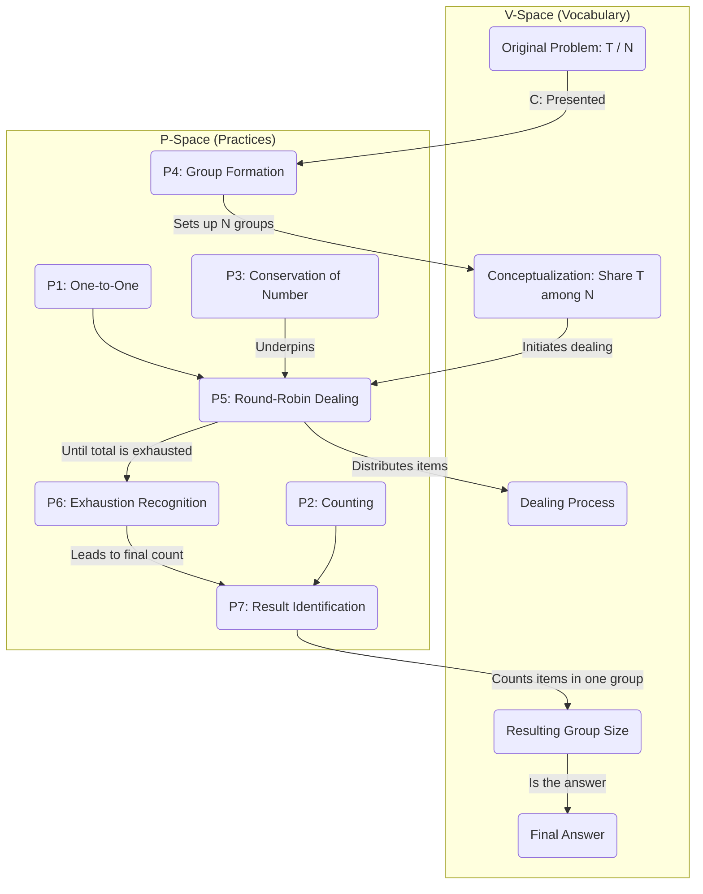
```mermaid
graph TD
    subgraph "V-Space (Vocabulary)"
        V1("Original Problem: T / N")
        V2("Conceptualization: Share T among N")
        V3("Dealing Process")
        V4("Resulting Group Size")
        V5("Final Answer")
    end

    subgraph "P-Space (Practices)"
        P1("P1: One-to-One")
        P2("P2: Counting")
        P3("P3: Conservation of Number")
        P4("P4: Group Formation")
        P5("P5: Round-Robin Dealing")
        P6("P6: Exhaustion Recognition")
        P7("P7: Result Identification")
    end

    %% Relationships
    V1 -- "C: Presented" --> P4
    P4 -- "Sets up N groups" --> V2
    V2 -- "Initiates dealing" --> P5
    P5 -- "Distributes items" --> V3
    P5 -- "Until total is exhausted" --> P6
    P6 -- "Leads to final count" --> P7
    P7 -- "Counts items in one group" --> V4
    V4 -- "Is the answer" --> V5

    %% Foundational Practices
    P1 --> P5
    P2 --> P7
    P3 -- "Underpins" --> P5
```

### Part A: Meaning-Use Analysis of "Inverse Distributive Reasoning (Division)"

#### 1. Central Material Inferences

This strategy involves breaking the dividend into "friendly" numbers that are easily divisible by the divisor. The core inferences are:

*   **A dividend can be decomposed into a sum of numbers that are each easily divisible by the divisor.** (e.g., in `132 / 4`, 132 can be seen as `120 + 12`).
*   **The division operation distributes over this addition.** The core inference is that `(A + B) / C` is equivalent to `(A / C) + (B / C)`. The total quotient is the sum of the partial quotients.

#### 2. PP-Necessities and PP-Sufficiencies

*   **PP-Necessities (Prerequisite Practices):**
    *   **P1 (Basic Multiplication/Division Facts):** To recognize "friendly" numbers and calculate the partial quotients.
    *   **P2 (Number Decomposition):** The ability to break a number into parts.
    *   **P3 (Distributive Principle):** A conceptual understanding that division distributes over addition.
    *   **P4 (Basic Addition):** To sum the partial quotients.

*   **PP-Sufficiencies (Practices Sufficient to Deploy):**
    *   **P5 (Strategic Decomposition):** The ability to decompose the dividend into numbers that are convenient multiples of the divisor. This is the key strategic element.
    *   **P6 (Partial Quotients Calculation):** The practice of dividing each part of the decomposed dividend by the divisor.
    *   **P7 (Summing Partial Quotients):** The practice of adding the results of the partial divisions to get the final answer.

#### 3. Circumstances and Consequences of Application

*   **Circumstances of Application:**
    *   A division problem is presented, especially one where the standard algorithm might be cumbersome or where the dividend has an obvious "friendly" decomposition relative to the divisor.

*   **Consequences of Application:**
    *   The complex division is transformed into a series of simpler divisions followed by an addition.
    *   This is a very powerful mental math strategy that demonstrates a deep, flexible understanding of number relationships.
    *   The final answer is the sum of the partial quotients.

#### 4. Meaning-Use Diagram (MUD) for "Inverse Distributive Reasoning (Division)"

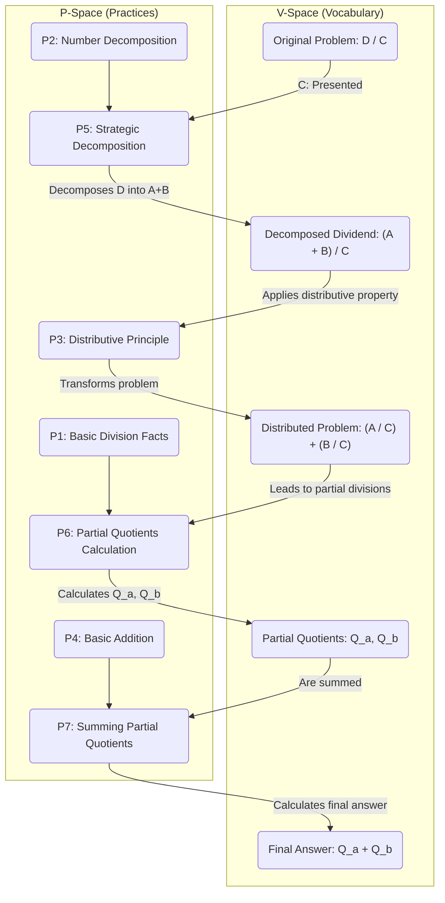
```mermaid
graph TD
    subgraph "V-Space (Vocabulary)"
        V1("Original Problem: D / C")
        V2("Decomposed Dividend: (A + B) / C")
        V3("Distributed Problem: (A / C) + (B / C)")
        V4("Partial Quotients: Q_a, Q_b")
        V5("Final Answer: Q_a + Q_b")
    end

    subgraph "P-Space (Practices)"
        P1("P1: Basic Division Facts")
        P2("P2: Number Decomposition")
        P3("P3: Distributive Principle")
        P4("P4: Basic Addition")
        P5("P5: Strategic Decomposition")
        P6("P6: Partial Quotients Calculation")
        P7("P7: Summing Partial Quotients")
    end

    %% Relationships
    V1 -- "C: Presented" --> P5
    P5 -- "Decomposes D into A+B" --> V2
    V2 -- "Applies distributive property" --> P3
    P3 -- "Transforms problem" --> V3
    V3 -- "Leads to partial divisions" --> P6
    P6 -- "Calculates Q_a, Q_b" --> V4
    V4 -- "Are summed" --> P7
    P7 -- "Calculates final answer" --> V5

    %% Foundational Practices
    P1 --> P6
    P2 --> P5
    P4 --> P7
```

### Part A: Meaning-Use Analysis of "Using Commutative Reasoning (Division)"

#### 1. Central Material Inferences

This strategy, more accurately described as **Quotative Division** or **Division by Measurement**, relies on the inverse relationship between division and multiplication. The name "Using Commutative Reasoning" is potentially confusing, as division is not commutative. The reasoning likely refers to the implicit use of the commutative property of multiplication when reframing the problem.

The core inferences are:
*   **A division problem `E / G` can be reframed as a "missing factor" multiplication problem: `? x G = E`.**
*   **The unknown factor can be found by repeatedly adding the known factor `G` and counting the number of additions required to reach the total `E`.**

#### 2. PP-Necessities and PP-Sufficiencies

*   **PP-Necessities (Prerequisite Practices):**
    *   **P1 (Basic Addition):** To perform the repeated additions of the divisor `G`.
    *   **P2 (Counting):** To count the number of iterations/groups.
    *   **P3 (Inverse Relationship of Mul/Div):** A conceptual understanding that `E / G = ?` is equivalent to `? x G = E`.

*   **PP-Sufficiencies (Practices Sufficient to Deploy):**
    *   **P4 (Problem Reframing):** The ability to transform the division problem into a "how many groups of G are in E?" question.
    *   **P5 (Iterative Addition/Accumulation):** The practice of repeatedly adding `G` while keeping a running total.
    *   **P6 (Termination and Counting):** The ability to stop when the running total reaches `E` and to report the number of iterations as the quotient.

#### 3. Circumstances and Consequences of Application

*   **Circumstances of Application:**
    *   A division problem is presented, especially one where the quotient is a small whole number, making repeated addition a feasible strategy.
    *   It is a foundational strategy for understanding the "measurement" or "quotative" meaning of division.

*   **Consequences of Application:**
    *   The division is transformed into a series of additions, which can be more intuitive than a "sharing" model for certain problems.
    *   The strategy becomes inefficient for problems with large quotients.
    *   The final answer is the number of times the divisor was added to reach the dividend.

#### 4. Meaning-Use Diagram (MUD) for "Using Commutative Reasoning (Division)"

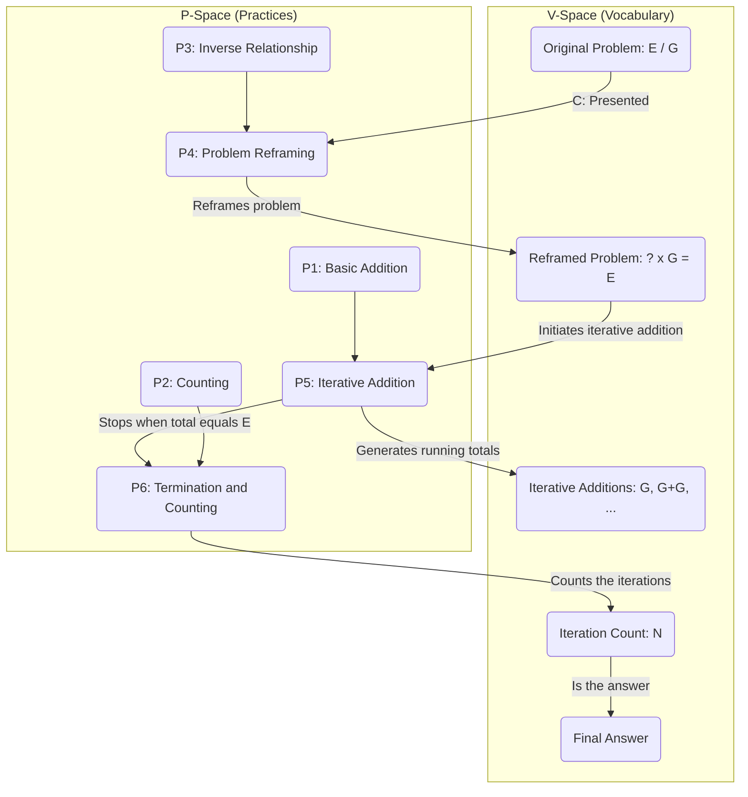
```mermaid
graph TD
    subgraph "V-Space (Vocabulary)"
        V1("Original Problem: E / G")
        V2("Reframed Problem: ? x G = E")
        V3("Iterative Additions: G, G+G, ...")
        V4("Iteration Count: N")
        V5("Final Answer")
    end

    subgraph "P-Space (Practices)"
        P1("P1: Basic Addition")
        P2("P2: Counting")
        P3("P3: Inverse Relationship")
        P4("P4: Problem Reframing")
        P5("P5: Iterative Addition")
        P6("P6: Termination and Counting")
    end

    %% Relationships
    V1 -- "C: Presented" --> P4
    P4 -- "Reframes problem" --> V2
    V2 -- "Initiates iterative addition" --> P5
    P5 -- "Generates running totals" --> V3
    P5 -- "Stops when total equals E" --> P6
    P6 -- "Counts the iterations" --> V4
    V4 -- "Is the answer" --> V5

    %% Foundational Practices
    P1 --> P5
    P2 --> P6
    P3 --> P4
```

### Part A: Meaning-Use Analysis of "Conversion to Groups Other than Bases (CGOB Division)"

#### 1. Central Material Inferences

This is a highly sophisticated strategy for division. The core inferences are:

*   **A dividend can be decomposed by place value.** (e.g., `84` becomes `80 + 4`).
*   **A base unit (e.g., 10) can be conceptually analyzed and regrouped in terms of the divisor.** This is the key inference. For `84 / 6`, one infers that `10 = 1*6 + 4`.
*   **This relationship, derived from a single base unit, can be scaled up using the distributive property.** For `80`, which is `8 * 10`, this becomes `8 * (1*6 + 4) = (8*6) + (8*4) = 48 + 32`.
*   **The original problem can be entirely reconstituted in these new terms, and the partial quotients summed.** The problem `(80 + 4) / 6` becomes `(48 + 32 + 4) / 6`, which simplifies to `(48/6) + (36/6) = 8 + 6 = 14`.

#### 2. PP-Necessities and PP-Sufficiencies

*   **PP-Necessities (Prerequisite Practices):**
    *   **P1 (Place Value Decomposition):** To break the dividend into its base-10 components.
    *   **P2 (Division with Remainder):** To perform the core analysis of the base unit versus the divisor (e.g., `10 / 6`).
    *   **P3 (Distributive Property):** To correctly scale the base/divisor relationship across the magnitude of the dividend's components.
    *   **P4 (Basic Arithmetic):** For multiplication and addition to consolidate remainders and sum the final partial quotients.

*   **PP-Sufficiencies (Practices Sufficient to Deploy):**
    *   **P5 (Base/Divisor Analysis):** The core practice of analyzing the base unit (10) in terms of the divisor (`C`) to find a quotient (`q`) and remainder (`r`).
    *   **P6 (Remainder Consolidation):** The ability to correctly scale the remainder `r` from the base analysis, add it to the original remainder from the dividend, and then divide that sum by the divisor.
    *   **P7 (Partial Quotient Synthesis):** The ability to identify all the partial quotients generated during this complex process and sum them to produce the final answer.

#### 3. Circumstances and Consequences of Application

*   **Circumstances of Application:**
    *   A division problem is presented, typically one where the divisor does not divide the base-10 components of the dividend evenly (e.g., 6 does not divide 80 or 4 evenly).
*   **Consequences of Application:**
    *   The problem is transformed through a series of abstract steps that demonstrate a deep, flexible understanding of number properties, moving beyond standard algorithms.
    *   It is a very powerful but likely uncommon mental math strategy, as it requires significant working memory and a strong grasp of the distributive property.

#### 4. Meaning-Use Diagram (MUD) for "Conversion to Groups Other than Bases (CGOB Division)"

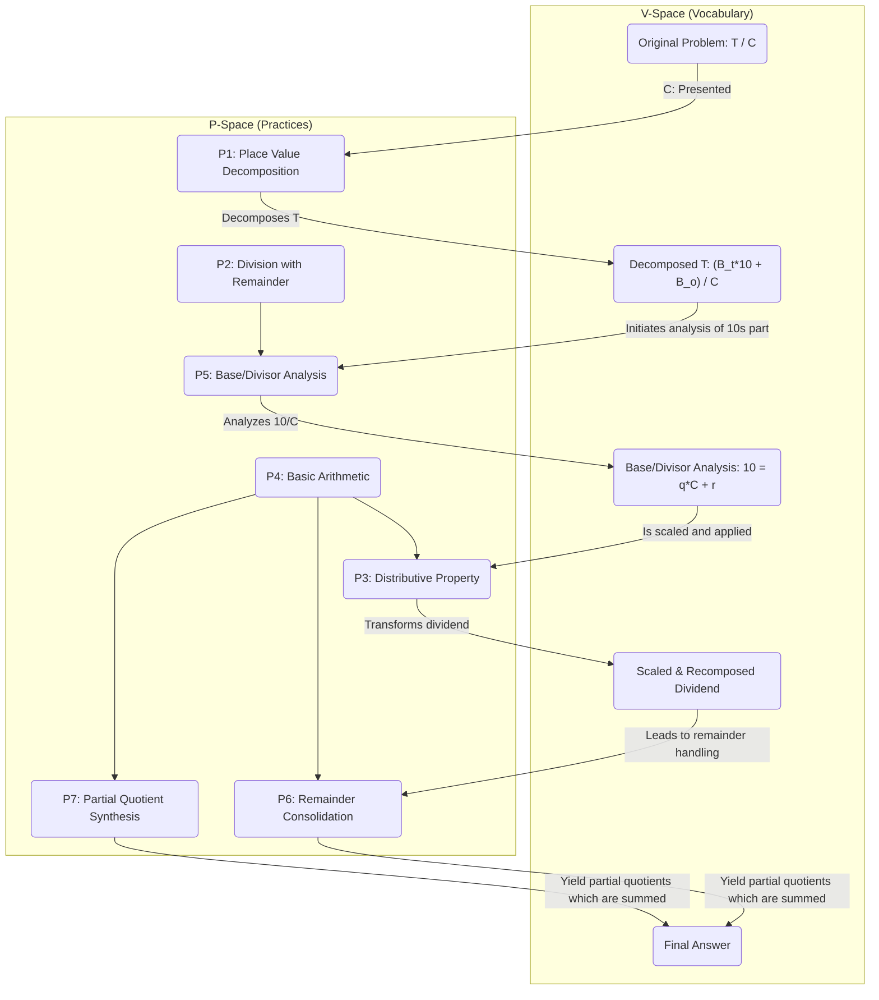
```mermaid
graph TD
    subgraph "V-Space (Vocabulary)"
        V1("Original Problem: T / C")
        V2("Decomposed T: (B_t*10 + B_o) / C")
        V3("Base/Divisor Analysis: 10 = q*C + r")
        V4("Scaled & Recomposed Dividend")
        V5("Final Answer")
    end

    subgraph "P-Space (Practices)"
        P1("P1: Place Value Decomposition")
        P2("P2: Division with Remainder")
        P3("P3: Distributive Property")
        P4("P4: Basic Arithmetic")
        P5("P5: Base/Divisor Analysis")
        P6("P6: Remainder Consolidation")
        P7("P7: Partial Quotient Synthesis")
    end

    %% Relationships
    V1 -- "C: Presented" --> P1
    P1 -- "Decomposes T" --> V2
    V2 -- "Initiates analysis of 10s part" --> P5
    P5 -- "Analyzes 10/C" --> V3
    V3 -- "Is scaled and applied" --> P3
    P3 -- "Transforms dividend" --> V4
    V4 -- "Leads to remainder handling" --> P6
    P6 & P7 -- "Yield partial quotients which are summed" --> V5


    %% Foundational Practices
    P2 --> P5
    P4 --> P3 & P6 & P7
```
